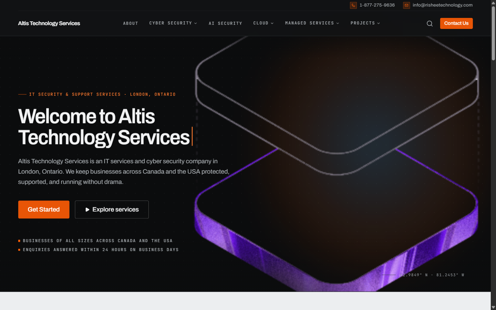

# Altis Technology Services

## Screenshot



## Description

Marketing site for Altis Technology Services, an IT services and cyber security company in London, Ontario. Built with Vite, React, TypeScript, Tailwind CSS, and React Router.

Pages include:

- Home — services overview, methodology, partners, and reviews
- About
- Contact
- AI Security (Agentic AI & AI Governance)

Navigation also covers Cyber Security, Cloud, Managed Services, and Projects.

## Install & run locally

### Prerequisites

- [Node.js](https://nodejs.org/) (v18 or newer recommended; CI uses Node 22)
- npm

### Install

```bash
git clone https://github.com/ashutosh2803/altis-technology-services.git
cd altis-technology-services
npm install
```

### Run

```bash
npm run dev
```

Open the URL shown in the terminal (usually `http://localhost:5173`).

### Format before you commit

GitHub Actions runs `npm run format:check`. Format the repo locally first:

```bash
npm run format
```
